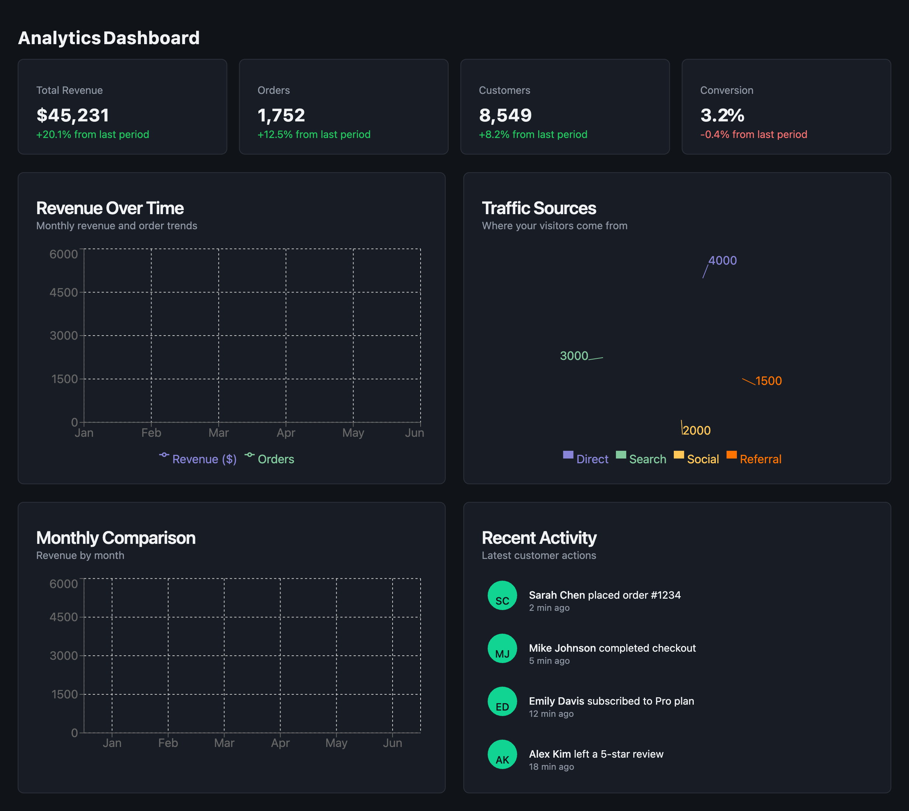
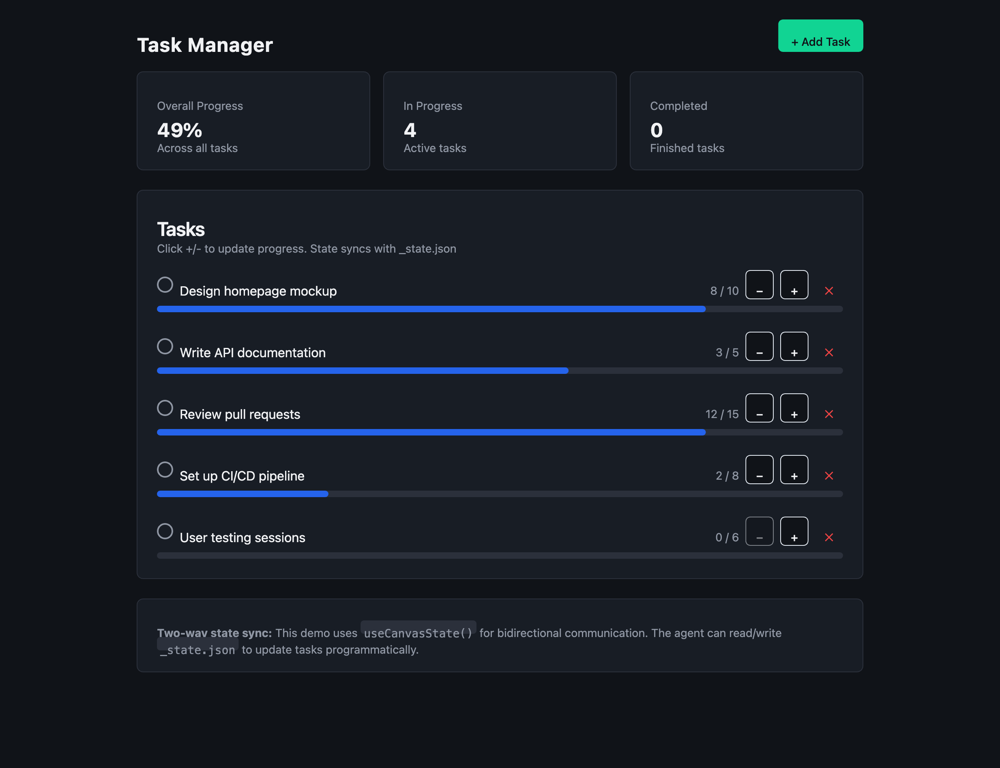
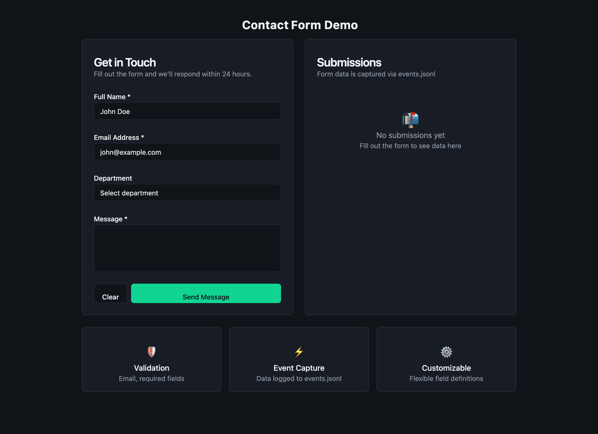
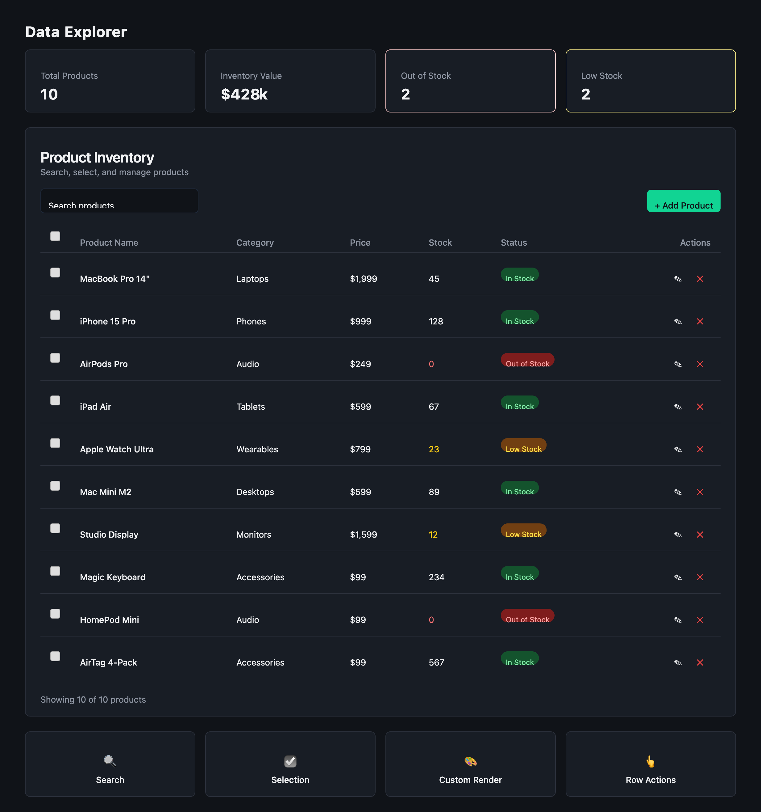

# Demo Gallery

Example artifacts showcasing Browser Canvas capabilities. Each demo is a working App.jsx you can run.

## Running the Demos

```bash
# Start the server
./server.sh

# The demos are in .claude/artifacts/ - they'll render automatically
```

---

## Analytics Dashboard

**Location:** `.claude/artifacts/analytics-dashboard/App.jsx`

A business analytics dashboard with real-time feel.



### Features Demonstrated

| Feature | How |
|---------|-----|
| Stat cards with trends | Card + CardContent with inline styling |
| Area charts | `AreaChart` with multiple series |
| Pie charts | `PieChart` with `Cell` for colors |
| Bar charts | `BarChart` with custom radius |
| Activity feed | Custom list with avatar circles |

### Components Used

- `Card`, `CardHeader`, `CardContent` - Layout containers
- `AreaChart`, `BarChart`, `PieChart` - Recharts visualizations
- `ResponsiveContainer`, `XAxis`, `YAxis`, `Legend` - Chart utilities

---

## Task Manager

**Location:** `.claude/artifacts/task-manager/App.jsx`

Interactive task tracker with two-way state sync.



### Features Demonstrated

| Feature | How |
|---------|-----|
| Two-way state | `useCanvasState()` |
| Progress tracking | Custom progress bars |
| CRUD operations | Add, update, delete tasks |
| Real-time sync | Agent can modify `_state.json` |

### Two-Way State Example

The agent can update tasks programmatically:

```bash
# Read current state
cat .claude/artifacts/task-manager/_state.json

# Update a task's progress
echo '{"tasks":[{"id":1,"title":"Design mockup","current":10,"max":10}]}' > .claude/artifacts/task-manager/_state.json
```

---

## Contact Form

**Location:** `.claude/artifacts/contact-form/App.jsx`

Validated form with event capture.



### Features Demonstrated

| Feature | How |
|---------|-----|
| Form validation | Email, phone, required fields |
| Custom fields | Text, email, tel, select, textarea |
| Event capture | Submissions logged to _log.jsonl |
| Success states | Confirmation message after submit |

### Event Capture

Form submissions appear in `_log.jsonl`:

```json
{"ts":"...","type":"event","event":"contact-submitted","data":{"name":"John","email":"john@example.com","message":"Hello!"}}
```

Filter events with: `grep '"type":"event"' _log.jsonl | tail -10`

### Field Types

```jsx
// Supported field types
{ type: "text", ... }
{ type: "email", ... }      // Email validation
{ type: "tel", ... }        // Phone validation
{ type: "textarea", ... }   // Multi-line input
{ type: "select", options: [...] }  // Dropdown
```

---

## Data Explorer

**Location:** `.claude/artifacts/data-explorer/App.jsx`

Searchable, selectable data table with actions.



### Features Demonstrated

| Feature | How |
|---------|-----|
| Search/filter | Built-in search across columns |
| Row selection | Checkboxes with bulk actions |
| Custom rendering | Badges, formatted prices |
| Row actions | Edit/delete buttons per row |
| Click events | Row clicks emit events |

### Events Emitted

| Event | When |
|-------|------|
| `edit-product` | Edit button clicked |
| `delete-product` | Delete button clicked |
| `product-clicked` | Row clicked |
| `selection-changed` | Selection changes |
| `bulk-action` | Bulk action button clicked |
| `add-product` | Add button clicked |

### Custom Column Rendering

```jsx
{
  key: "price",
  label: "Price",
  render: (value) => `$${value.toLocaleString()}`
}
```

---

## Creating Your Own Demos

1. Create a folder in `.claude/artifacts/`
2. Add an `App.jsx` file
3. The browser will open automatically

### Template

```jsx
function App() {
  return (
    <div className="p-6">
      <h1 className="text-2xl font-bold mb-4">My Demo</h1>
      {/* Your components here */}
    </div>
  )
}
```

### Available Components

**shadcn/ui:**
- `Card`, `Button`, `Input`, `Table`, `Dialog`, `Tabs`, `Select`, `Checkbox`, `Switch`, `Badge`, `Alert`, `Tooltip`, etc.

**Recharts:**
- `LineChart`, `BarChart`, `PieChart`, `AreaChart`, `ResponsiveContainer`, etc.

**Icons (Lucide):**
- All Lucide icons are available: `DollarSign`, `Users`, `TrendingUp`, `Plus`, `Trash2`, etc.
