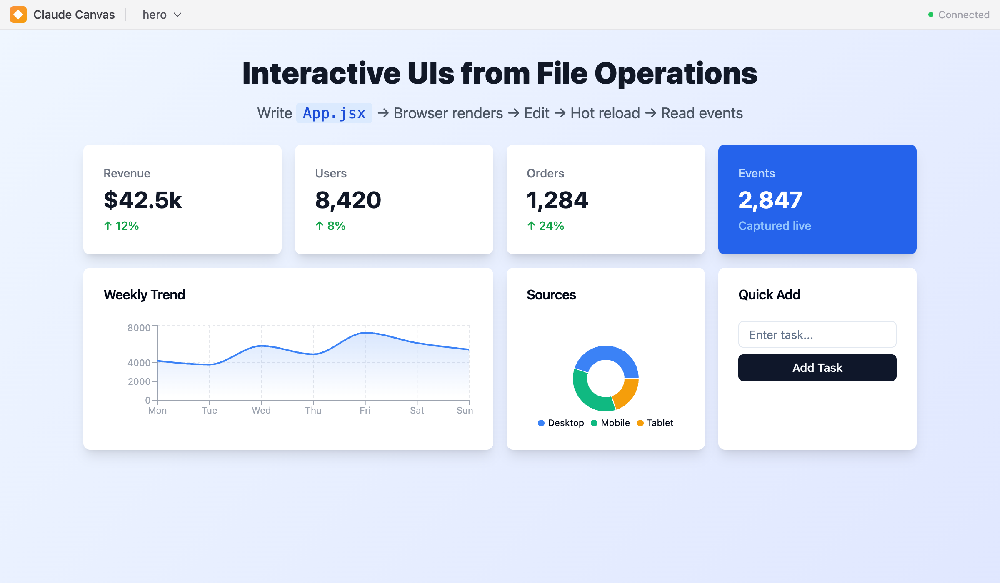

<p align="center">
  
</p>

<h1 align="center">Browser Canvas</h1>

<p align="center">
  <strong>Render React UIs in the browser using only file operations</strong>
</p>

<p align="center">
  <a href="#quick-start">Quick Start</a> •
  <a href="#features">Features</a> •
  <a href="#components">Components</a> •
  <a href="#documentation">Docs</a>
</p>

---

**Browser Canvas** lets Claude Code create interactive UIs by writing files. No API calls, no special protocols—just write `App.jsx` and watch it render.

```
Write App.jsx → Browser opens → Edit file → Hot reload → Read _log.jsonl
```

## Quick Start

### Install as Claude Code Plugin

```bash
# In Claude Code
/plugin install parkerhancock/browser-canvas
```

Restart Claude Code after installation.

### Manual Installation

Requires [Bun](https://bun.sh/) runtime.

```bash
git clone https://github.com/parkerhancock/browser-canvas.git
cd browser-canvas
bun install
./server.sh
```

The server watches `.claude/artifacts/` in your current directory. When Claude Code writes an `App.jsx` file there, a browser window opens automatically.

### How It Works

Once the server is running, Claude Code creates UIs by writing files:

```
.claude/artifacts/my-app/App.jsx  →  Browser opens  →  Hot reload on edit
```

Example component Claude might write:

```jsx
function App() {
  const [count, setCount] = useState(0);
  return (
    <Card className="w-80 mx-auto mt-8">
      <CardContent className="pt-6 text-center">
        <p className="text-4xl font-bold mb-4">{count}</p>
        <Button onClick={() => setCount(c => c + 1)}>+</Button>
      </CardContent>
    </Card>
  );
}
```

## Features

| Feature | How It Works |
|---------|--------------|
| **Hot Reload** | Edit `App.jsx` → browser updates instantly |
| **Unified Log** | Events, errors, validation → `_log.jsonl` (grep-friendly) |
| **Two-Way State** | Agent writes `_state.json` ↔ canvas reads/writes via `useCanvasState()` |
| **TypeScript API** | `CanvasClient` for screenshots, close, state operations |
| **Validation** | ESLint, scope checking, Tailwind, accessibility (axe-core) |
| **Auto-Feedback** | PostToolUse hook injects validation errors after writes |
| **Multi-Canvas** | Toolbar dropdown switches between artifacts |

## Components

Everything is pre-bundled and available without imports:

**React** — `useState`, `useEffect`, `useCallback`, `useMemo`, `useRef`, `useReducer`, `useCanvasState`

**shadcn/ui** — `Card`, `Button`, `Input`, `Table`, `Dialog`, `Tabs`, `Select`, `Checkbox`, `Switch`, `Badge`, `Alert`, `Tooltip`, and more

**Recharts** — `LineChart`, `BarChart`, `PieChart`, `AreaChart`, `ResponsiveContainer`, `XAxis`, `YAxis`, `Legend`

**Reusable Components** — `StatCard`, `DataChart`, `DataTable`, `ContactForm`, `ActivityFeed`, `ProgressList`, `MarkdownViewer`

**Utilities** — `cn()` for classNames, `format()` from date-fns, `Markdown`, `remarkGfm`, Tailwind CSS

## Two-Way State Sync

For stateful artifacts, `useCanvasState()` provides bidirectional communication:

```jsx
function App() {
  const [state, setState] = useCanvasState();
  return (
    <div>
      <p>{state.message || "Waiting for agent..."}</p>
      <Button onClick={() => setState({ ...state, confirmed: true })}>
        Confirm
      </Button>
    </div>
  );
}
```

Agent reads/writes `_state.json`:
```bash
# Agent sets initial state
echo '{"message":"Please confirm"}' > .claude/artifacts/my-app/_state.json

# Agent reads state after user interaction
cat .claude/artifacts/my-app/_state.json
# {"message":"Please confirm","confirmed":true}
```

## TypeScript API

Use `CanvasClient` for operations:

```typescript
import { CanvasClient } from "browser-canvas"

const client = await CanvasClient.fromServerJson()

await client.screenshot("my-app")  // Take screenshot
await client.close("my-app")       // Close canvas
await client.getState("my-app")    // Get state
await client.setState("my-app", { step: 2 })  // Set state
await client.getStatus("my-app")   // Get validation status
await client.list()                // List canvases
await client.health()              // Check server health
```

## Unified Log

All activity goes to `_log.jsonl`. Use grep to filter:

```bash
grep '"type":"event"' _log.jsonl | tail -10      # User interactions
grep '"severity":"error"' _log.jsonl | head -5   # Errors only
grep '"category":"scope"' _log.jsonl             # Missing components
```

Log types: `event`, `notice`, `render`, `screenshot`
Notice categories: `runtime`, `lint`, `eslint`, `scope`, `tailwind`, `overflow`, `image`, `bundle`

## Directory Structure

```
.claude/artifacts/
├── server.json              # Server state (port, active canvases)
├── _server.log              # Server logs
└── my-canvas/
    ├── App.jsx              # Your component
    ├── _log.jsonl           # Unified log (events, errors, validation)
    ├── _state.json          # Two-way state
    └── _screenshot.png      # Screenshot output (via API)
```

## Configuration

```bash
# Default: .claude/artifacts/ in current directory
./server.sh

# Custom directory
CANVAS_DIR=/path/to/artifacts ./server.sh
./server.sh --dir /path/to/artifacts
```

## Project Extensions

Extend browser-canvas with project-specific libraries and styles. Create files in `.claude/canvas/`:

| Extension | File | Purpose |
|-----------|------|---------|
| **Libraries** | `scope.ts` | Add npm packages to canvas scope |
| **Tailwind** | `tailwind.config.js` | Add Tailwind plugins |
| **Custom CSS** | `styles.css` | Custom CSS rules |

### Adding Libraries

```bash
# Install a package
bun add react-markdown
```

```typescript
// .claude/canvas/scope.ts
import ReactMarkdown from "react-markdown"

export const extend = {
  ReactMarkdown
}
```

### Adding Tailwind Plugins

```bash
bun add -d @tailwindcss/typography
```

```javascript
// .claude/canvas/tailwind.config.js
export default {
  plugins: [
    require('@tailwindcss/typography'),
  ],
}
```

### Custom CSS

```css
/* .claude/canvas/styles.css */
.custom-gradient {
  background: linear-gradient(135deg, #667eea 0%, #764ba2 100%);
}
```

Extensions are detected at server startup and bundled automatically (~50ms rebuild).

## Documentation

- **[SKILL.md](skills/canvas/SKILL.md)** — Full skill reference for Claude Code

## Development

```bash
bun run dev          # Development server (with hot reload)
bun run build        # Production build
bun run typecheck    # Type check
```

## Architecture

- **Server**: Bun + Hono (HTTP + WebSocket)
- **Browser**: react-runner with pre-bundled component scope
- **Styling**: Tailwind CSS + shadcn/ui
- **File Watching**: chokidar
- **Screenshots**: html2canvas

## License

MIT
